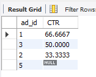
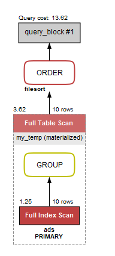

把資料庫建起來的SQL
```SQL
create table Ads (
	ad_id int,
    user_id int,
    action enum("Clicked", "Viewed", "Ignored"),
    primary key (ad_id, user_id)
);

insert into Ads (ad_id, user_id, action) VALUES 
(1,1,"Clicked"), 
(2,2,"Clicked"), 
(3,3,"Viewed"), 
(5,5,"Ignored"), 
(1,7,"Ignored"), 
(2,7,"Viewed"), 
(3,5,"Clicked"),
(1,4,"Viewed"), 
(2,11,"Viewed"), 
(1,2,"Clicked");
```


我的解法
```SQL
with my_temp
AS
(SELECT ad_id, 
		SUM(CASE WHEN action="Clicked" THEN 1 ELSE 0 END) as click_num, 
		SUM(CASE WHEN action="Viewed" THEN 1 ELSE 0 END) as viewed_num from ads group by ad_id)
select
	ad_id, (click_num/(click_num+viewed_num) * 100) as CTR
FROM my_temp order by CTR desc;
```
這種的解法問題點就是會有空值



如果更了解條件判定就會知道有`in`可以使用，可能會更簡潔
```SQL
with my_temp
AS
(SELECT ad_id, 
		SUM(CASE WHEN action="Clicked" THEN 1 ELSE 0 END) as click_num, 
		SUM(CASE WHEN action in ("Viewed", "Clicked") THEN 1 ELSE 0 END) as total from ads group by ad_id)
select
	ad_id, (click_num/total * 100) as CTR
FROM my_temp order by CTR desc;
```

如果是用MYSQL workbench還可以看query plan，雖然看不太懂就是了
