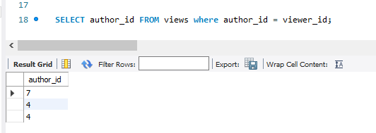

把資料庫建起來的SQL
```SQL
create table Views (
	article_id int,
    author_id int,
    viewer_id int,
    view_date date
);

INSERT INTO Views (article_id, author_id, viewer_id, view_date) VALUES
(1, 3, 4, "2019-08-01"),
(1, 3, 6, "2019-08-02"),
(2, 7, 7, "2019-08-01"),
(2, 7, 6, "2019-08-02"),
(4, 7, 1, "2019-07-22"),
(3, 4, 4, "2019-07-21"),
(3, 4, 4, "2019-07-21")
```

查詢的SQL
```SQL
SELECT distinct author_id FROM views where author_id = viewer_id ORDER BY author_id;
```

去重是最麻煩的事情，不過用distinct可以解決

