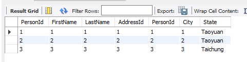

把資料庫建起來的SQL
```SQL
CREATE TABLE person_14(
    PersonId    int,
    FirstName   varchar(20),
    LastName    varchar(20),
    PRIMARY KEY (PersonId)
);

CREATE TABLE address_14(
    AddressId   int,
    PersonId    int,
    City        varchar(20),
    State       varchar(20),
    FOREIGN KEY (PersonID) REFERENCES person_14(PersonID)
);

INSERT INTO person_14
(PersonId, FirstName, LastName)
VALUES 
(1, "1", "1"),
(2, "2", "2"),
(3, "3", "3"),
(4, "4", "4");

INSERT INTO address_14
(AddressId, PersonId, City, State)
VALUES 
(1, 1, "1", "Taoyuan"),
(2, 2, "2", "Taoyuan"),
(3, 3, "3", "Taichung");
```

查詢的SQL
```SQL
SELECT * FROM myjdbc.person_14 join myjdbc.address_14 where person_14.PersonId = address_14.PersonId;
```
這種寫法如下圖，但是不符合，題目敘述中的「regardless if there is an address for each of those people」

`join`是兩個table都要匹配到才會出現，可以想像成交集。
`left join`就是有所有A table的rows，如果B table沒有匹配到的就留null值如下

```SQL
SELECT * FROM myjdbc.person_14 left join 
myjdbc.address_14 on 
person_14.PersonId = address_14.PersonId;
```