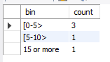

把資料庫建起來的SQL
```SQL
CREATE TABLE session_2(
    session_id int,
    duration   int,
    PRIMARY KEY (session_id)
);

INSERT INTO session_2 (session_id, duration) VALUES
(1, 30),
(2, 199),
(3, 299),
(4, 580),
(5, 1000);
```

查詢的SQL
```SQL
SELECT 
CASE
	WHEN duration < 300 THEN "[0-5>"
    WHEN duration < 600 THEN "[5-10>"
    WHEN duration < 900 THEN "[10-15>"
    ELSE "15 or more"
END AS bin, count(*) as count
FROM myjdbc.session_2 group by bin;
```

上面這種做法的問題點就是有出現count為0的狀況，那種`bin`不會被列出來。
另一種做法就是分開做然後再全部UNION起來，如原作者的解答那樣