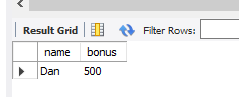

建立table的SQL
```sql
CREATE TABLE employee_4 (
    empId            int,
    name             varchar(20),
    supervisor       int,
    salary           int,
    PRIMARY KEY (empId)
);

INSERT INTO employee_4 (empId, name, supervisor, salary) VALUES
(1, "John", 3, 1000),
(2, "Dan", 3, 2000),
(3, "Brad", null, 4000),
(4, "Thomas", 3, 4000);

create table bonus_4 (
	empId            int,
    bonus            int,
    FOREIGN KEY (empId) REFERENCES employee_4(empId)
);

INSERT INTO bonus_4 (empId, bonus) VALUES
(2, 500),
(4, 2000);
```

查詢的SQL
```sql
select name, bonus from employee_4 natural join bonus_4 where bonus < 1000;
```

natural join是取交集，所以最後輸出的結果可能不會包含所有employee，因此要保留所有
employee，要用left join

```sql
select name, bonus from employee_4 left join bonus_4 on employee_4.empId = bonus_4.empId where bonus < 1000 or bonus is NULL ;
```
小於判定要特別注意，不會包含NULL